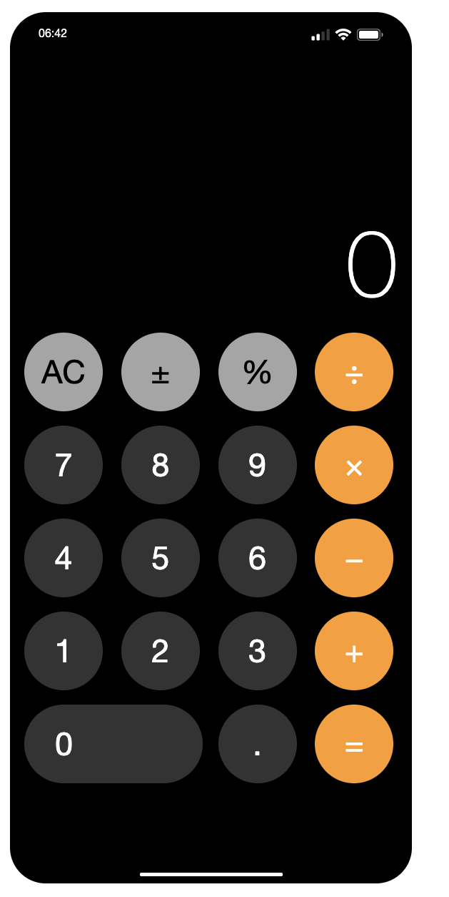

# The iPad Calculator BETA

The repo for the iPad calculator code-along using HTML, CSS, and Vanilla JavaScript!

Symbols used in this app: `± % ÷ × − + =`

Feel free to use this code for your personal projects!
 

## Extra Challenges

- Make keyboard inputs work with the calculator
- Limit the visible display number to 9 digits
- Make display font size dynamically change for when you have 6, 7, 8, 9 digits
